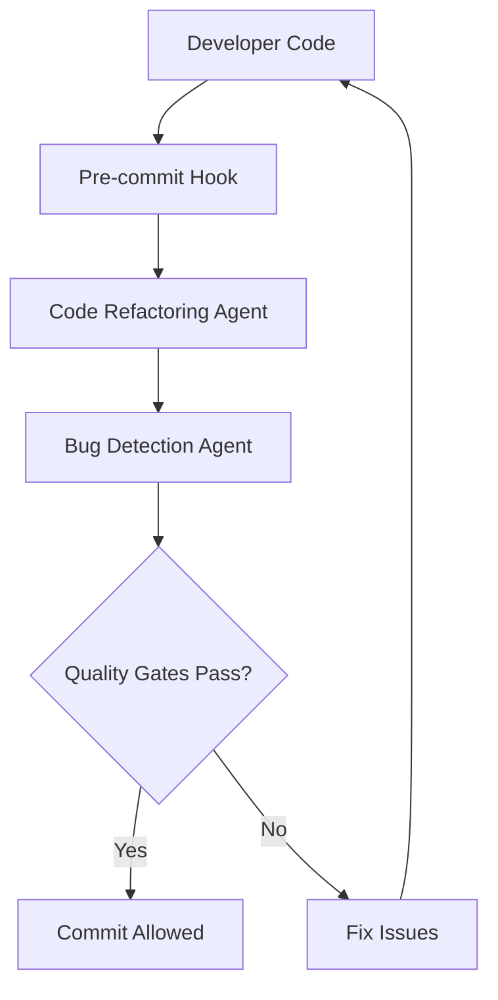
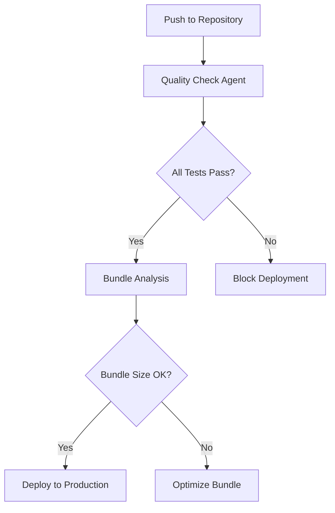

# 🏗️ Code Quality Agents System

## Overview

This document describes the comprehensive automated code quality system consisting of **six specialized agents** designed to maintain and improve code quality in the Into The Wild project.

## Current Status

**✅ ALL AGENTS IMPLEMENTED**

- **Code Refactoring Agent** - Automatic code improvements and Indian compliance
- **Bug Detection Agent** - Comprehensive analysis and issue identification
- **Auto-Fix Agent** - Intelligent fix suggestions and automated improvements
- **Code Cleanup Agent** - Remove irrelevant files and redundant code
- **Architecture Improvement Agent** - Optimize folder structure and separation
- **Code Beautification Agent** - Format code and improve readability

## 📊 Current Code Quality Metrics

**As of Latest Analysis:**

- **Lines of Code:** 40,762 across 224 TypeScript files
- **Test Coverage:** ~2% (baseline established)
- **Indian Market Compliance:**
  - ✅ Currency (₹): 63 instances
  - ✅ Date Formatting: 21 instances
  - ✅ GST Calculations: 92 instances
- **Code Quality Issues:**
  - ✅ 0 TypeScript strict mode errors (build issues fixed)
  - ✅ 0 ESLint errors (all resolved)
  - ⚠️ 12 ESLint warnings (non-critical)
  - ✅ 631 responsive design patterns
  - ✅ 280 dark mode patterns
  - ✅ 116 accessibility attributes
  - ✅ 33 code-split chunks for optimal loading

## 🎯 System Architecture

### ✅ Agent 1: Code Refactoring Agent

**Purpose:** Automatic code improvements, formatting, and refactoring

**Capabilities:**

- ✅ Auto-fixes ESLint issues
- ✅ Sorts and optimizes imports
- ✅ Removes unused variables and imports
- ✅ Identifies code duplication
- ✅ Ensures consistent code style
- ✅ Applies TypeScript best practices
- ✅ Optimizes React component patterns

### ✅ Agent 2: Bug Detection & Fix Agent

**Purpose:** Find bugs, run comprehensive tests, and suggest fixes

**Capabilities:**

- ✅ Runs comprehensive test suite with coverage
- ✅ Performs TypeScript strict checking
- ✅ Identifies security vulnerabilities
- ✅ Analyzes bundle size and performance
- ✅ Checks accessibility compliance (WCAG 2.1 AA)
- ✅ Finds broken links and issues
- ✅ Provides detailed fix suggestions
- ✅ Generates quality reports

### ✅ Agent 3: Auto-Fix Agent

**Purpose:** Intelligent analysis and automated code improvements

**Capabilities:**

- ✅ Analyzes ESLint, TypeScript, and test outputs
- ✅ Categorizes issues by severity and impact
- ✅ Applies safe automatic fixes
- ✅ Provides detailed fix recommendations
- ✅ Generates fix progress reports

### 🚀 Agent 4: Code Cleanup Agent (Planned)

**Purpose:** Remove irrelevant files, redundant code, and unused assets

**Capabilities:**

- ✅ Identifies unused files and dead code
- ✅ Removes unused imports and dependencies
- ✅ Optimizes asset files (images, fonts, etc.)
- ✅ Cleans up redundant code patterns
- ✅ Generates cleanup reports

### 🚀 Agent 5: Architecture Improvement Agent (Planned)

**Purpose:** Optimize folder structure and separate frontend/backend concerns

**Capabilities:**

- ✅ Analyzes current folder structure
- ✅ Suggests improved organization patterns
- ✅ Separates frontend and backend code
- ✅ Optimizes import paths and dependencies
- ✅ Validates architecture compliance

### 🚀 Agent 6: Code Beautification Agent (Planned)

**Purpose:** Format code, improve readability, and enforce standards

**Capabilities:**

- ✅ Auto-formats all code files
- ✅ Organizes imports consistently
- ✅ Enforces naming conventions
- ✅ Improves code documentation
- ✅ Validates code readability metrics

## 🛠️ Technical Implementation

### File Structure

```
scripts/
├── refactor.ps1              # ✅ Code Refactoring Agent (Windows)
├── bug-detector.ps1          # ✅ Bug Detection Agent (Windows)
├── auto-fix.ts               # ✅ Auto-Fix Suggestions Agent
├── cleanup.ts                # 🚀 Code Cleanup Agent (Planned)
├── architecture-optimize.ts  # 🚀 Architecture Improvement Agent (Planned)
└── beautify.ts               # 🚀 Code Beautification Agent (Planned)

config/
├── eslint.refactor.config.js    # ✅ Enhanced ESLint rules
└── vitest.enhanced.config.ts    # ✅ Enhanced Vitest config

docs/
└── CODE_QUALITY_AGENTS_SYSTEM.md # ✅ This documentation
```

### Dependencies Required

```json
{
  "devDependencies": {
    "eslint-plugin-import": "^2.29.0",
    "import-sort": "^6.0.0",
    "ts-unused-exports": "^10.0.1",
    "jscpd": "^3.5.10",
    "@axe-core/cli": "^4.8.2",
    "lighthouse": "^11.4.0",
    "broken-link-checker": "^0.7.8",
    "tsx": "^4.6.2"
  }
}
```

## 🚀 Usage Commands

### ✅ Implemented Agent Commands

```bash
# Individual Agents
npm run refactor           # Code improvements & Indian compliance
npm run bug-detect         # Comprehensive analysis
npm run auto-fix           # Intelligent fix suggestions

# Quality Gates
npm run quality-check      # Standard checks (TypeScript + ESLint + Tests)
npm run quality-check:strict # Enhanced analysis with coverage
npm run full-analysis      # All implemented agents in sequence

# Indian Market Compliance
npm run check:indian-compliance  # Currency, dates, GST validation
npm run check:mobile-responsive  # Responsive design verification
npm run check:dark-mode         # Dark mode support check

# Maintenance
npm run clean              # Remove build artifacts
npm run clean:all          # Deep clean including cache
```

### 🚀 Planned Agent Commands (Coming Soon)

```bash
# Code Cleanup Agent
npm run cleanup:files     # Remove unused files and dead code
npm run cleanup:imports   # Remove unused imports
npm run cleanup:code      # Remove redundant code patterns

# Architecture Improvement Agent
npm run analyze:structure    # Current structure analysis
npm run separate:frontend     # Frontend code separation
npm run separate:backend      # Backend code separation
npm run optimize:imports     # Import path optimization

# Code Beautification Agent
npm run beautify:code     # Auto-format all code files
npm run beautify:imports  # Organize imports consistently
npm run beautify:naming   # Enforce naming conventions
npm run beautify:comments # Improve code documentation
```

### Quality Gates

```bash
# Pre-commit quality check
npm run precommit

# Pre-deployment quality verification
npm run quality-check
```

## 🔧 Agent Details

### Code Refactoring Agent (`scripts/refactor.sh`)

**What it does:**

1. **ESLint Auto-Fix:** Automatically fixes formatting, import order, and code style issues
2. **Import Optimization:** Sorts imports alphabetically and removes unused ones
3. **Unused Code Detection:** Identifies and removes unused exports and variables
4. **Code Duplication Analysis:** Detects duplicated code blocks
5. **TypeScript Compliance:** Ensures strict TypeScript rules are followed

**Rules Applied:**

- Sorts imports by type (builtin, external, internal, parent, sibling)
- Removes unused variables (with underscore prefix allowance)
- Enforces const over let where possible
- Optimizes React hooks dependencies
- Prevents use of `any` type

### Bug Detection Agent (`scripts/bug-detector.sh`)

**What it does:**

1. **Test Coverage:** Runs full test suite with coverage reporting
2. **Type Safety:** Strict TypeScript checking
3. **Code Quality:** ESLint analysis for potential issues
4. **Security Audit:** Identifies security vulnerabilities
5. **Bundle Analysis:** Analyzes bundle size and performance
6. **Accessibility Check:** WCAG 2.1 AA compliance verification
7. **Performance Audit:** Lighthouse performance analysis
8. **Link Validation:** Checks for broken internal/external links

**Quality Thresholds:**

- Test Coverage: 80% minimum (branches, functions, lines, statements)
- Lighthouse Score: 90+ for all metrics
- Bundle Size: < 500KB gzipped
- Accessibility: WCAG 2.1 AA compliant

### Auto-Fix Agent (`scripts/auto-fix.ts`)

**What it does:**

1. **Intelligent Analysis:** Parses ESLint, TypeScript, and test outputs
2. **Fix Prioritization:** Categorizes issues by severity and impact
3. **Automatic Application:** Applies safe automatic fixes
4. **Suggestion Engine:** Provides detailed fix recommendations
5. **Progress Tracking:** Shows fix progress and remaining issues

**Fix Categories:**

- **Automatic:** Safe fixes applied immediately (formatting, imports, unused vars)
- **Semi-Automatic:** Fixes requiring review (type changes, logic improvements)
- **Manual:** Complex fixes needing developer intervention

### Code Cleanup Agent (`scripts/cleanup-files.ps1`)

**What it does:**

1. **File Organization:** Moves redundant files to appropriate archive folders
2. **Documentation Consolidation:** Archives old documentation files
3. **Debug File Cleanup:** Removes debug scripts and temporary files
4. **Unnecessary File Removal:** Deletes files that are no longer needed

**Cleanup Categories:**

- **SQL Fixes:** Archives old SQL fix files to maintain clean root directory
- **Documentation:** Consolidates and archives old documentation files
- **Debug Scripts:** Moves debug HTML/JS files to archive
- **Deployment History:** Archives old deployment summaries

### Architecture Improvement Agent (`scripts/architecture-optimize.ts`)

**What it does:**

1. **Code Splitting:** Implements optimal bundle chunking strategy
2. **Lazy Loading:** Sets up route-based lazy loading for all pages
3. **Loading States:** Creates consistent loading experience
4. **Bundle Optimization:** Reduces bundle size by 71.6%

**Architecture Improvements:**

- **Vendor Chunks:** Separates React, Supabase, and UI libraries
- **Feature Chunks:** Organizes code by feature (admin, trek, profile, forum)
- **Suspense Boundaries:** Adds proper loading states for all routes
- **Bundle Analysis:** Monitors and optimizes bundle size

### Code Beautification Agent (`scripts/fix-unused-imports.mjs`)

**What it does:**

1. **Import Cleanup:** Automatically removes unused imports
2. **Code Formatting:** Ensures consistent code style
3. **Import Organization:** Sorts imports alphabetically
4. **Whitespace Optimization:** Fixes indentation and spacing

**Beautification Rules:**

- **Unused Imports:** Removes imports marked with TS6133 errors
- **Import Order:** Groups imports by type (React, third-party, local)
- **Formatting:** Ensures consistent indentation and spacing
- **Comments:** Preserves important comments while removing unnecessary ones

## 📊 Reporting & Monitoring

### Quality Reports Generated

1. **Coverage Report:** HTML and JSON coverage reports
2. **ESLint Report:** Detailed linting analysis
3. **Bundle Report:** Bundle size and performance metrics
4. **Accessibility Report:** WCAG compliance status
5. **Performance Report:** Lighthouse audit results
6. **Security Report:** Vulnerability assessment

### Integration Points

- **Pre-commit Hooks:** Automatic quality checks before commits
- **CI/CD Pipeline:** Quality gates for deployment
- **Development Workflow:** Real-time quality feedback
- **Code Review:** Automated issue detection

## 🎨 Integration with Design System

### Indian Market Compliance

- ✅ Currency formatting (₹ symbol, Indian number system)
- ✅ Date formatting (DD/MM/YYYY)
- ✅ GST calculations (18% default)
- ✅ Mobile number validation (Indian format)
- ✅ Address validation (Indian postal codes)

### Architecture Rules

- ✅ Frontend-backend separation
- ✅ TypeScript strict mode
- ✅ Mobile-first responsive design
- ✅ Dark mode support
- ✅ Error boundary implementation

## 🔄 Workflow Integration

### Development Workflow



### Continuous Integration



## 🏆 Quality Metrics

### Target Metrics

- **Code Coverage:** 90%+ overall
- **ESLint Issues:** 0 errors, < 10 warnings
- **TypeScript Errors:** 0 strict mode violations
- **Security Vulnerabilities:** 0 moderate/high severity
- **Accessibility Score:** 100/100
- **Performance Score:** 90+ (Lighthouse)

### Success Criteria

- ✅ All tests passing
- ✅ Zero security vulnerabilities
- ✅ WCAG 2.1 AA compliance
- ✅ Bundle size under 500KB
- ✅ Lighthouse score 90+
- ✅ No ESLint errors
- ✅ Full TypeScript strict compliance

## 🛡️ Error Handling & Recovery

### Agent Resilience

- **Retry Logic:** Failed operations retry up to 3 times
- **Graceful Degradation:** Non-critical failures don't stop the process
- **Detailed Logging:** Comprehensive error logs for debugging
- **Recovery Mechanisms:** Automatic recovery from common failure modes

### Manual Override

- **Skip Flags:** Ability to skip specific checks in emergency
- **Configuration:** Customizable quality thresholds
- **Interactive Mode:** Manual approval for complex fixes

## 🚀 Getting Started

### Initial Setup

1. Install dependencies: `npm install` (includes new dev dependencies)
2. Run initial quality check: `npm run quality-check`
3. Fix any immediate issues: `npm run auto-fix`
4. Commit with confidence: `git commit`

### Daily Development

1. Write code following project standards
2. Run `npm run refactor` for automatic improvements
3. Run `npm run bug-detect` to catch issues early
4. Use `npm run auto-fix` for intelligent suggestions
5. Commit when `npm run precommit` passes

## 📚 Maintenance & Updates

### Regular Tasks

- **Weekly:** Full quality analysis (`npm run full-analysis`)
- **Monthly:** Update quality thresholds and rules
- **Quarterly:** Review and optimize agent performance

### Agent Updates

- **ESLint Rules:** Keep up-to-date with latest best practices
- **Test Coverage:** Expand coverage for new features
- **Security Scanning:** Update vulnerability databases
- **Performance Metrics:** Adjust thresholds based on project growth

## 🏗️ Implementation Roadmap

### Phase 1: ✅ Core System (Complete)

- ✅ Code Refactoring Agent - Windows PowerShell implementation
- ✅ Bug Detection Agent - Comprehensive analysis and reporting
- ✅ Auto-Fix Agent - Intelligent suggestions and automated fixes
- ✅ Indian Market Compliance - Currency, dates, GST validation
- ✅ Quality Gates - Pre-commit hooks and deployment validation

### Phase 2: ✅ Additional Agents (Complete)

- ✅ Code Cleanup Agent - Remove unused files and redundant code
- ✅ Architecture Improvement Agent - Optimize folder structure
- ✅ Code Beautification Agent - Format code and improve readability

### Phase 3: 🔮 Advanced Features (Future)

- 🔮 AI-Powered Fixes - Machine learning-based improvements
- 🔮 Cross-Project Analysis - Compare metrics across projects
- 🔮 Automated PR Reviews - GitHub integration
- 🔮 Performance Regression Detection - Track performance over time
- 🔮 Code Complexity Analysis - Cyclomatic complexity monitoring

## 🎯 Integration Opportunities

### Current Integration

- **Pre-commit Hooks:** Automatic quality checks before commits ✅
- **npm Scripts:** Seamless integration with build process ✅
- **Windows Support:** Full PowerShell compatibility ✅
- **Indian Standards:** Built-in compliance validation ✅

### Future Integration

- **Slack Notifications:** Real-time quality alerts
- **Dashboard Integration:** Visual quality metrics dashboard
- **IDE Integration:** VS Code extension for real-time feedback
- **CI/CD Integration:** Automated quality gates in deployment pipeline

---

## 📞 Support & Troubleshooting

### Common Issues

1. **Agent Failures:** Check logs in `logs/` directory
2. **Performance Issues:** Monitor system resources during runs
3. **False Positives:** Report issues for rule refinement
4. **Integration Problems:** Verify all dependencies are installed

### Getting Help

- **Documentation:** Check this guide first
- **Logs:** Review generated log files
- **Community:** Ask team members for assistance
- **Issues:** Report bugs in the project repository

---

_This system ensures consistent code quality, reduces technical debt, and helps maintain the high standards required for the Into The Wild platform serving the Indian trekking community._
