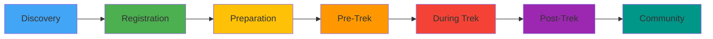

# Into The Wild - Messaging, Notifications & Communication System

## Complete UX Strategy for PWA

> **Version:** 1.1 - Enhanced Gallery & Media Edition  
> **Date:** January 25, 2025  
> **Application Type:** Progressive Web App (PWA)  
> **Focus:** Trek-Centric Communication for Indian Mobile Users  
> **Status:** Comprehensive Strategy & Implementation Guide  
> **New in v1.1:** 🆕 Gallery Engagement, Media Sharing, User Contributions, Tag-Based Discovery

---

## 📋 Table of Contents

1. [Executive Summary](#1-executive-summary)
2. [PWA Foundation & Capabilities](#2-pwa-foundation--capabilities)
3. [Current Implementation Analysis](#3-current-implementation-analysis)
4. [Strategic Vision & Principles](#4-strategic-vision--principles)
5. [In-App Notifications & Toasts](#5-in-app-notifications--toasts)
6. [Nudges & Contextual Guidance](#6-nudges--contextual-guidance)
7. [User Onboarding Workflows](#7-user-onboarding-workflows)
8. [WhatsApp Integration](#8-whatsapp-integration)
9. [Trek Lifecycle Communication](#9-trek-lifecycle-communication)
10. [Admin Communication Tools](#10-admin-communication-tools)
11. [Gallery & Media Communication](#11-gallery--media-communication)
12. [User Preference Center](#12-user-preference-center)
13. [Implementation Roadmap](#13-implementation-roadmap)
14. [Technical Architecture](#14-technical-architecture)
15. [Success Metrics](#15-success-metrics)

---

## 1. Executive Summary

### 1.1 Purpose

This document defines the complete messaging and notification strategy for Into The Wild PWA, focusing on:

- **Reducing Anxiety**: Keep trekkers informed throughout their journey
- **Building Excitement**: Create anticipation for upcoming treks
- **Fostering Community**: Connect participants and encourage engagement
- **Ensuring Safety**: Provide timely alerts and emergency communication
- **Gathering Feedback**: Enable post-trek engagement and improvement

### 1.2 Key Objectives

| Objective                  | Target | Current Status  |
| -------------------------- | ------ | --------------- |
| Notification Open Rate     | >60%   | 🔄 To Implement |
| User Onboarding Completion | >85%   | 🔄 To Implement |
| WhatsApp Opt-In Rate       | >75%   | ✅ 200+ members |
| Trek Checklist Completion  | >90%   | 🔄 To Implement |
| Post-Trek Feedback Rate    | >50%   | 🔄 To Implement |

### 1.3 Indian User Context

**Why This Matters:**

- 🇮🇳 **80% mobile usage** in India - Mobile-first is mandatory
- 📱 **WhatsApp penetration**: 530+ million users in India
- 🌐 **Network conditions**: Design for poor connectivity
- 💰 **Data-consciousness**: Optimize for low data usage
- 🗣️ **Communication preference**: WhatsApp > Email > SMS

---

## 2. PWA Foundation & Capabilities

### 2.1 What Makes This a PWA

#### Core PWA Features

```javascript
// manifest.json - PWA Configuration
{
  "name": "Into The Wild - Open Hikers Club",
  "short_name": "Into The Wild",
  "description": "India's Trusted Trekking Community Platform",
  "start_url": "/",
  "display": "standalone",
  "background_color": "#F4A460",
  "theme_color": "#F4A460",
  "orientation": "portrait-primary",
  "icons": [
    {
      "src": "/icons/icon-72x72.png",
      "sizes": "72x72",
      "type": "image/png",
      "purpose": "any maskable"
    },
    {
      "src": "/icons/icon-192x192.png",
      "sizes": "192x192",
      "type": "image/png",
      "purpose": "any maskable"
    },
    {
      "src": "/icons/icon-512x512.png",
      "sizes": "512x512",
      "type": "image/png",
      "purpose": "any maskable"
    }
  ],
  "categories": ["travel", "sports", "lifestyle"],
  "screenshots": [
    {
      "src": "/screenshots/home-mobile.png",
      "sizes": "540x720",
      "type": "image/png",
      "form_factor": "narrow"
    }
  ]
}
```

#### Service Worker Strategy

```javascript
// Service Worker for Offline Support & Push Notifications
// sw.js

const CACHE_VERSION = "v1.0.0";
const STATIC_CACHE = `static-${CACHE_VERSION}`;
const DYNAMIC_CACHE = `dynamic-${CACHE_VERSION}`;

// Cache static assets
const STATIC_ASSETS = [
  "/",
  "/index.html",
  "/manifest.json",
  "/itw_logo.png",
  "/styles/main.css",
  "/scripts/app.js",
];

// Install event - cache static assets
self.addEventListener("install", (event) => {
  event.waitUntil(
    caches
      .open(STATIC_CACHE)
      .then((cache) => cache.addAll(STATIC_ASSETS))
      .then(() => self.skipWaiting()),
  );
});

// Activate event - clean old caches
self.addEventListener("activate", (event) => {
  event.waitUntil(
    caches
      .keys()
      .then((keys) =>
        Promise.all(
          keys
            .filter((key) => key !== STATIC_CACHE && key !== DYNAMIC_CACHE)
            .map((key) => caches.delete(key)),
        ),
      )
      .then(() => self.clients.claim()),
  );
});

// Fetch event - network first, cache fallback
self.addEventListener("fetch", (event) => {
  const { request } = event;

  // API requests - network first
  if (request.url.includes("/api/")) {
    event.respondWith(
      fetch(request)
        .then((response) => {
          const clonedResponse = response.clone();
          caches
            .open(DYNAMIC_CACHE)
            .then((cache) => cache.put(request, clonedResponse));
          return response;
        })
        .catch(() => caches.match(request)),
    );
    return;
  }

  // Static assets - cache first
  event.respondWith(
    caches.match(request).then((cached) => cached || fetch(request)),
  );
});

// Push notification handler
self.addEventListener("push", (event) => {
  const data = event.data.json();
  const options = {
    body: data.body,
    icon: "/icons/icon-192x192.png",
    badge: "/icons/badge-72x72.png",
    vibrate: [200, 100, 200],
    data: {
      url: data.url || "/",
      notificationId: data.id,
    },
    actions: [
      {
        action: "view",
        title: "View Details",
        icon: "/icons/view-icon.png",
      },
      {
        action: "close",
        title: "Dismiss",
        icon: "/icons/close-icon.png",
      },
    ],
  };

  event.waitUntil(self.registration.showNotification(data.title, options));
});

// Notification click handler
self.addEventListener("notificationclick", (event) => {
  event.notification.close();

  if (event.action === "view") {
    event.waitUntil(clients.openWindow(event.notification.data.url));
  }
});
```

### 2.2 PWA Installation Prompts

#### Smart Install Prompt

```tsx
// components/PWAInstallPrompt.tsx
import React, { useState, useEffect } from "react";
import { Button } from "@/components/ui/button";
import { Card } from "@/components/ui/card";
import { Download, X, Smartphone } from "lucide-react";

interface PWAInstallPromptProps {
  onInstall?: () => void;
  onDismiss?: () => void;
}

export const PWAInstallPrompt: React.FC<PWAInstallPromptProps> = ({
  onInstall,
  onDismiss,
}) => {
  const [deferredPrompt, setDeferredPrompt] = useState<any>(null);
  const [showPrompt, setShowPrompt] = useState(false);

  useEffect(() => {
    const handler = (e: any) => {
      e.preventDefault();
      setDeferredPrompt(e);

      // Show prompt after user has interacted with the site
      setTimeout(() => {
        const hasPromptedBefore = localStorage.getItem("pwa-prompt-dismissed");
        if (!hasPromptedBefore) {
          setShowPrompt(true);
        }
      }, 30000); // Show after 30 seconds
    };

    window.addEventListener("beforeinstallprompt", handler);
    return () => window.removeEventListener("beforeinstallprompt", handler);
  }, []);

  const handleInstall = async () => {
    if (!deferredPrompt) return;

    deferredPrompt.prompt();
    const { outcome } = await deferredPrompt.userChoice;

    if (outcome === "accepted") {
      onInstall?.();
    }

    setDeferredPrompt(null);
    setShowPrompt(false);
  };

  const handleDismiss = () => {
    localStorage.setItem("pwa-prompt-dismissed", "true");
    setShowPrompt(false);
    onDismiss?.();
  };

  if (!showPrompt) return null;

  return (
    <Card
      className="fixed bottom-20 left-4 right-4 md:left-auto md:right-4 md:max-w-md z-50 
                     bg-gradient-to-br from-primary/5 via-background to-secondary/5 
                     border-2 border-primary/20 shadow-2xl animate-slide-up"
    >
      <div className="p-6">
        <button
          onClick={handleDismiss}
          className="absolute top-2 right-2 p-2 rounded-full hover:bg-muted"
        >
          <X className="h-4 w-4" />
        </button>

        <div className="flex gap-4">
          <div className="flex-shrink-0">
            <div className="w-16 h-16 bg-primary/10 rounded-xl flex items-center justify-center">
              <Smartphone className="h-8 w-8 text-primary" />
            </div>
          </div>

          <div className="flex-1">
            <h3 className="font-bold text-lg mb-2">Install Into The Wild</h3>
            <p className="text-sm text-muted-foreground mb-4">
              Get instant access, offline support, and push notifications for
              your treks!
            </p>

            <div className="flex gap-2">
              <Button onClick={handleInstall} className="flex-1" size="sm">
                <Download className="mr-2 h-4 w-4" />
                Install App
              </Button>
              <Button onClick={handleDismiss} variant="ghost" size="sm">
                Maybe Later
              </Button>
            </div>
          </div>
        </div>
      </div>
    </Card>
  );
};
```

### 2.3 Offline Support

#### Offline Indicator

```tsx
// components/OfflineIndicator.tsx
import React, { useState, useEffect } from "react";
import { WifiOff, Wifi } from "lucide-react";
import { Alert, AlertDescription } from "@/components/ui/alert";

export const OfflineIndicator: React.FC = () => {
  const [isOnline, setIsOnline] = useState(navigator.onLine);
  const [showReconnected, setShowReconnected] = useState(false);

  useEffect(() => {
    const handleOnline = () => {
      setIsOnline(true);
      setShowReconnected(true);
      setTimeout(() => setShowReconnected(false), 3000);
    };

    const handleOffline = () => {
      setIsOnline(false);
    };

    window.addEventListener("online", handleOnline);
    window.addEventListener("offline", handleOffline);

    return () => {
      window.removeEventListener("online", handleOnline);
      window.removeEventListener("offline", handleOffline);
    };
  }, []);

  if (isOnline && !showReconnected) return null;

  return (
    <div className="fixed top-16 left-4 right-4 md:left-auto md:right-4 md:max-w-md z-50">
      {!isOnline ? (
        <Alert
          variant="warning"
          className="bg-amber-50 dark:bg-amber-950/30 border-amber-200 dark:border-amber-800"
        >
          <WifiOff className="h-4 w-4" />
          <AlertDescription className="ml-2">
            You're offline. Some features may be limited.
          </AlertDescription>
        </Alert>
      ) : (
        <Alert
          variant="success"
          className="bg-green-50 dark:bg-green-950/30 border-green-200 dark:border-green-800 animate-slide-down"
        >
          <Wifi className="h-4 w-4" />
          <AlertDescription className="ml-2">
            Back online! Syncing your data...
          </AlertDescription>
        </Alert>
      )}
    </div>
  );
};
```

---

## 3. Current Implementation Analysis

### 3.1 What's Already Built

✅ **Notification Database Schema**

```sql
-- notifications table with RLS policies
CREATE TABLE public.notifications (
    id BIGSERIAL PRIMARY KEY,
    user_id UUID NOT NULL REFERENCES auth.users(id) ON DELETE CASCADE,
    message TEXT NOT NULL,
    link TEXT,
    status notification_status_enum NOT NULL DEFAULT 'unread',
    type notification_type_enum NOT NULL DEFAULT 'general_info',
    trek_id INTEGER REFERENCES public.trek_events(trek_id) ON DELETE SET NULL,
    related_entity_id BIGINT,
    created_at TIMESTAMPTZ NOT NULL DEFAULT NOW()
);

-- Supported types
CREATE TYPE notification_type_enum AS ENUM (
    'registration_confirmed',
    'payment_verified',
    'trek_cancelled',
    'trek_status_changed',
    'general_info'
);
```

✅ **Toast System**

- Radix UI Toast + Sonner integration
- Theme-aware (light/dark mode)
- Basic variants: default, destructive

✅ **Forum & Community**

- Forum system with 25 nature/adventure tags
- Thread discussions
- User avatars (Indian wildlife theme)

✅ **WhatsApp Community**

- 200+ active members in WhatsApp group
- Personal number-based (basic setup)
- Manual coordination currently

### 3.2 Gaps to Address

❌ **Missing Features:**

1. Progressive onboarding flow for new users
2. Contextual nudges and tooltips
3. Enhanced toast variants (success, warning, info, trek-specific)
4. Notification preference center
5. Automated trek lifecycle notifications
6. Smart notification grouping
7. Pre-trek reminder system
8. Post-trek engagement automation
9. Weather alert integration
10. WhatsApp API automation (currently manual)

---

## 4. Strategic Vision & Principles

### 4.1 Core UX Principles

#### 1. Mobile-First Everything

**80% of Indian users are mobile-only**

```typescript
// Mobile-first design tokens
const mobileFirst = {
  touchTargets: {
    minimum: "44px", // Apple & Android guidelines
    comfortable: "48px", // Preferred size
    spacing: "16px", // Between targets
  },

  safeAreas: {
    top: "env(safe-area-inset-top)",
    bottom: "env(safe-area-inset-bottom)",
    left: "env(safe-area-inset-left)",
    right: "env(safe-area-inset-right)",
  },

  gestures: {
    swipe: true, // Swipe to dismiss toasts
    pullToRefresh: true, // Pull to refresh lists
    longPress: true, // Long press for options
  },

  haptics: {
    light: "success", // Light tap
    medium: "warning", // Medium tap
    heavy: "error", // Heavy tap
  },
};
```

#### **Enhanced Mobile Card Experience**

```typescript
// Mobile cards now support better notification targeting
const mobileCardFeatures = {
  horizontalScroll: true, // Better content discovery
  fixedHeights: true, // Consistent layout for notifications
  touchOptimized: true, // Improved engagement
  responsiveBreakpoints: true, // Desktop ↔ mobile seamless transition
};

// This enables better notification placement and user engagement
// as users can now easily browse and discover trek content on mobile
```

#### 2. Network-Aware Design

**Handle poor connectivity gracefully**

```typescript
// Network quality detection
const useNetworkQuality = () => {
  const [quality, setQuality] = useState<'4g' | '3g' | '2g' | 'offline'>('4g');

  useEffect(() => {
    const connection = (navigator as any).connection;
    if (!connection) return;

    const updateQuality = () => {
      const type = connection.effectiveType;
      setQuality(type === 'slow-2g' ? '2g' : type);
    };

    connection.addEventListener('change', updateQuality);
    updateQuality();

    return () => connection.removeEventListener('change', updateQuality);
  }, []);

  return quality;
};

// Adaptive loading based on network
const AdaptiveImage = ({ src, alt, placeholder }) => {
  const quality = useNetworkQuality();

  const imageSrc = quality === '2g' || quality === '3g'
    ? placeholder  // Low-res placeholder
    : src;        // Full resolution

  return ;
};
```

#### 3. Context-Aware Notifications

**Right message, right time, right channel**

```typescript
const notificationStrategy = {
  critical: {
    // Trek cancellations, emergencies
    channels: ["push", "sms", "whatsapp", "in-app"],
    timing: "immediate",
    retries: 3,
    expiryHours: 24,
  },

  important: {
    // Registration confirmations, weather alerts
    channels: ["push", "whatsapp", "in-app"],
    timing: "respectQuietHours",
    retries: 2,
    expiryHours: 48,
  },

  informational: {
    // Trek updates, community posts
    channels: ["in-app", "email"],
    timing: "batched",
    retries: 1,
    expiryHours: 168, // 7 days
  },

  marketing: {
    // New treks, offers
    channels: ["email", "in-app"],
    timing: "optimal", // Based on user activity
    retries: 0,
    expiryHours: 336, // 14 days
  },
};
```

### 4.2 Trek Journey Philosophy

**Every notification aligns with the trek lifecycle**



**Communication at Each Stage:**

| Stage         | Goal    | Notifications                               | Channel Priority        |
| ------------- | ------- | ------------------------------------------- | ----------------------- |
| Discovery     | Inspire | Trek recommendations, Featured destinations | In-App, Email           |
| Registration  | Confirm | Booking confirmation, Payment receipt       | WhatsApp, In-App, Email |
| Preparation   | Inform  | Packing lists, Requirements, Group invite   | WhatsApp, In-App        |
| Pre-Trek (7d) | Remind  | Countdown, Checklist, Weather updates       | WhatsApp, Push          |
| During Trek   | Support | Safety check-ins, Milestone celebrations    | In-App                  |
| Post-Trek     | Engage  | Feedback request, Photo sharing, Ratings    | In-App, Email           |
| Community     | Connect | Forum replies, Recommendations, Stories     | In-App                  |

---

## 5. In-App Notifications & Toasts

### 5.1 Enhanced Toast System

#### New Toast Variants

```typescript
// Enhanced toast types with nature-inspired styling
export type ToastVariant =
  | "default" // Neutral information
  | "success" // Completed actions (green, leaf icon)
  | "error" // Errors, failures (red, alert icon)
  | "warning" // Important notices (amber, warning icon)
  | "info" // General information (blue, info icon)
  | "trek-update" // Trek-specific updates (golden, mountain icon)
  | "achievement" // Milestones, badges (purple, star icon)
  | "community" // Forum, social updates (teal, users icon)
  | "weather"; // Weather alerts (sky blue, cloud icon);
```

#### Toast Component Implementation

```tsx
// components/ui/enhanced-toast.tsx
import React from "react";
import {
  Toast,
  ToastDescription,
  ToastProvider,
  ToastTitle,
  ToastViewport,
} from "@/components/ui/toast";
import {
  Leaf,
  AlertTriangle,
  Info,
  Mountain,
  Star,
  Users,
  CloudRain,
  AlertCircle,
  Check,
} from "lucide-react";
import { cn } from "@/lib/utils";

interface EnhancedToastProps {
  variant: ToastVariant;
  title: string;
  description?: string;
  action?: {
    label: string;
    onClick: () => void;
  };
  duration?: number;
}

const variantConfig = {
  success: {
    icon: Leaf,
    className:
      "bg-green-50 dark:bg-green-950/30 border-green-200 dark:border-green-700",
    iconColor: "text-green-600 dark:text-green-400",
  },
  error: {
    icon: AlertCircle,
    className:
      "bg-red-50 dark:bg-red-950/30 border-red-200 dark:border-red-700",
    iconColor: "text-red-600 dark:text-red-400",
  },
  warning: {
    icon: AlertTriangle,
    className:
      "bg-amber-50 dark:bg-amber-950/30 border-amber-200 dark:border-amber-700",
    iconColor: "text-amber-600 dark:text-amber-400",
  },
  info: {
    icon: Info,
    className:
      "bg-blue-50 dark:bg-blue-950/30 border-blue-200 dark:border-blue-700",
    iconColor: "text-blue-600 dark:text-blue-400",
  },
  "trek-update": {
    icon: Mountain,
    className: "bg-primary/10 dark:bg-primary/20 border-primary/30",
    iconColor: "text-primary",
  },
  achievement: {
    icon: Star,
    className:
      "bg-purple-50 dark:bg-purple-950/30 border-purple-200 dark:border-purple-700",
    iconColor: "text-purple-600 dark:text-purple-400",
  },
  community: {
    icon: Users,
    className:
      "bg-teal-50 dark:bg-teal-950/30 border-teal-200 dark:border-teal-700",
    iconColor: "text-teal-600 dark:text-teal-400",
  },
  weather: {
    icon: CloudRain,
    className:
      "bg-sky-50 dark:bg-sky-950/30 border-sky-200 dark:border-sky-700",
    iconColor: "text-sky-600 dark:text-sky-400",
  },
};

export const EnhancedToast: React.FC<EnhancedToastProps> = ({
  variant,
  title,
  description,
  action,
  duration = 5000,
}) => {
  const config = variantConfig[variant];
  const Icon = config.icon;

  return (
    <Toast className={cn("border-2", config.className)} duration={duration}>
      <div className="flex items-start gap-3">
        <div
          className={cn(
            "w-10 h-10 rounded-full flex items-center justify-center",
            "bg-white/80 dark:bg-black/20 animate-bounce-in",
          )}
        >
          <Icon className={cn("h-5 w-5", config.iconColor)} />
        </div>

        <div className="flex-1">
          <ToastTitle className="font-semibold">{title}</ToastTitle>
          {description && (
            <ToastDescription className="mt-1">{description}</ToastDescription>
          )}
          {action && (
            <button
              onClick={action.onClick}
              className="mt-2 text-sm font-medium underline underline-offset-2"
            >
              {action.label}
            </button>
          )}
        </div>
      </div>
    </Toast>
  );
};
```

#### Usage Examples

```tsx
// Example toast notifications
import { useToast } from "@/hooks/use-toast";

const TrekRegistrationSuccess = () => {
  const { toast } = useToast();

  const handleRegister = async () => {
    // ... registration logic

    toast({
      variant: "success",
      title: "Registration Confirmed! 🎒",
      description: 'Your spot on "Kedarkantha Winter Trek" is secured!',
      action: {
        label: "View Details →",
        onClick: () => navigate("/trek/123"),
      },
    });
  };
};

const WeatherAlert = () => {
  const { toast } = useToast();

  useEffect(() => {
    toast({
      variant: "weather",
      title: "Weather Advisory",
      description: "Light snowfall expected on Day 2. Pack extra warm layers!",
      action: {
        label: "View Forecast",
        onClick: () => window.open("https://weather.com/..."),
      },
      duration: 10000, // Stay longer for important alerts
    });
  }, []);
};

const AchievementUnlocked = () => {
  const { toast } = useToast();

  toast({
    variant: "achievement",
    title: "Achievement Unlocked! 🏆",
    description: "You've completed your 10th trek!",
    action: {
      label: "View Badges",
      onClick: () => navigate("/profile/achievements"),
    },
  });
};
```

### 5.2 Notification Center

```tsx
// components/NotificationCenter.tsx
import React, { useState } from "react";
import { Bell, Mountain, Users, Settings, Star } from "lucide-react";
import { Tabs, TabsContent, TabsList, TabsTrigger } from "@/components/ui/tabs";
import { Button } from "@/components/ui/button";
import { Badge } from "@/components/ui/badge";
import { Card } from "@/components/ui/card";
import { useNotifications } from "@/hooks/useNotifications";

export const NotificationCenter: React.FC = () => {
  const { notifications, unreadCount, markAsRead, markAllAsRead } =
    useNotifications();
  const [activeTab, setActiveTab] = useState("all");

  // Group notifications by type
  const grouped = {
    trek: notifications.filter((n) => n.type.includes("trek")),
    community: notifications.filter(
      (n) => n.type.includes("forum") || n.type.includes("comment"),
    ),
    system: notifications.filter((n) => n.type === "general_info"),
    achievements: notifications.filter((n) => n.type === "achievement"),
  };

  return (
    <div className="fixed inset-0 bg-background z-50 md:relative md:max-w-md">
      {/* Header */}
      <div className="sticky top-0 bg-background border-b p-4 flex items-center justify-between">
        <h2 className="text-xl font-bold flex items-center gap-2">
          <Bell className="h-5 w-5" />
          Notifications
          {unreadCount > 0 && (
            <Badge variant="destructive" className="animate-pulse">
              {unreadCount}
            </Badge>
          )}
        </h2>
        <Button
          variant="ghost"
          size="sm"
          onClick={markAllAsRead}
          disabled={unreadCount === 0}
        >
          Mark all read
        </Button>
      </div>

      {/* Tabs */}
      <Tabs value={activeTab} onValueChange={setActiveTab}>
        <TabsList className="w-full justify-start overflow-x-auto">
          <TabsTrigger value="all" className="flex items-center gap-2">
            <Bell className="h-4 w-4" />
            All
            {unreadCount > 0 && (
              <Badge variant="secondary" size="sm">
                {unreadCount}
              </Badge>
            )}
          </TabsTrigger>
          <TabsTrigger value="trek" className="flex items-center gap-2">
            <Mountain className="h-4 w-4" />
            Treks
            {grouped.trek.filter((n) => n.status === "unread").length > 0 && (
              <Badge variant="secondary" size="sm">
                {grouped.trek.filter((n) => n.status === "unread").length}
              </Badge>
            )}
          </TabsTrigger>
          <TabsTrigger value="community" className="flex items-center gap-2">
            <Users className="h-4 w-4" />
            Community
          </TabsTrigger>
          <TabsTrigger value="achievements" className="flex items-center gap-2">
            <Star className="h-4 w-4" />
            Achievements
          </TabsTrigger>
        </TabsList>

        <TabsContent value="all" className="p-4 space-y-3">
          {notifications.length === 0 ? (
            <EmptyState message="No notifications yet" />
          ) : (
            notifications.map((notification) => (
              <NotificationCard
                key={notification.id}
                notification={notification}
                onRead={() => markAsRead(notification.id)}
              />
            ))
          )}
        </TabsContent>

        {/* Other tabs... */}
      </Tabs>
    </div>
  );
};

const NotificationCard = ({ notification, onRead }) => {
  return (
    <Card
      className={cn(
        "p-4 cursor-pointer transition-colors",
        notification.status === "unread" && "bg-primary/5 border-primary/20",
      )}
      onClick={onRead}
    >
      <div className="flex gap-3">
        <NotificationIcon type={notification.type} />
        <div className="flex-1 min-w-0">
          <h4 className="font-semibold text-sm mb-1">{notification.title}</h4>
          <p className="text-sm text-muted-foreground line-clamp-2">
            {notification.message}
          </p>
          <div className="flex items-center gap-2 mt-2 text-xs text-muted-foreground">
            <TimeAgo date={notification.created_at} />
            {notification.type && (
              <Badge
                variant={getNotificationVariant(notification.type)}
                size="sm"
              >
                {notification.type}
              </Badge>
            )}
          </div>
        </div>
      </div>
    </Card>
  );
};
```

### 5.3 Smart Notification Grouping

```typescript
// hooks/useSmartNotifications.ts
export const useSmartNotifications = () => {
  const { notifications } = useNotifications();

  // Group by trek and time
  const grouped = useMemo(() => {
    const result = {
      today: [],
      yesterday: [],
      thisWeek: [],
      older: [],
    };

    const now = new Date();
    const today = startOfDay(now);
    const yesterday = subDays(today, 1);
    const weekAgo = subDays(today, 7);

    // Group by trek first
    const trekGroups = groupBy(notifications, "trek_id");

    Object.entries(trekGroups).forEach(([trekId, trekNotifs]) => {
      const latest = trekNotifs[0].created_at;
      const latestDate = new Date(latest);

      const group = {
        type: "trek-group",
        trek_id: trekId,
        trek_name: trekNotifs[0].trek_name,
        notifications: trekNotifs,
        count: trekNotifs.length,
        latest: latest,
      };

      if (isAfter(latestDate, today)) {
        result.today.push(group);
      } else if (isAfter(latestDate, yesterday)) {
        result.yesterday.push(group);
      } else if (isAfter(latestDate, weekAgo)) {
        result.thisWeek.push(group);
      } else {
        result.older.push(group);
      }
    });

    return result;
  }, [notifications]);

  return grouped;
};
```

---

## 6. Nudges & Contextual Guidance

### 6.1 Profile Completion Nudge

```tsx
// components/nudges/ProfileCompletionNudge.tsx
import React from "react";
import { Card } from "@/components/ui/card";
import { Button } from "@/components/ui/button";
import { User, CircularProgress } from "lucide-react";
import { useAuth } from "@/components/auth/AuthProvider";

export const ProfileCompletionNudge: React.FC = () => {
  const { userProfile } = useAuth();

  const completionPercentage = useMemo(() => {
    const fields = [
      "full_name",
      "phone_number",
      "date_of_birth",
      "address",
      "emergency_contact",
      "blood_group",
    ];

    const completed = fields.filter((field) => userProfile?.[field]).length;
    return Math.round((completed / fields.length) * 100);
  }, [userProfile]);

  // Only show if less than 70% complete
  if (completionPercentage >= 70) return null;

  return (
    <Card
      className="p-6 bg-gradient-to-br from-amber-50 to-yellow-50/80 
                     dark:from-amber-950/40 dark:to-yellow-950/20 
                     border-2 border-amber-200/50 dark:border-amber-800/50"
    >
      <div className="flex items-start gap-4">
        {/* Circular Progress */}
        <div className="relative w-16 h-16">
          <svg className="w-16 h-16 transform -rotate-90">
            <circle
              cx="32"
              cy="32"
              r="28"
              stroke="currentColor"
              strokeWidth="4"
              fill="none"
              className="text-muted"
            />
            <circle
              cx="32"
              cy="32"
              r="28"
              stroke="currentColor"
              strokeWidth="4"
              fill="none"
              strokeDasharray={`${2 * Math.PI * 28}`}
              strokeDashoffset={`${2 * Math.PI * 28 * (1 - completionPercentage / 100)}`}
              className="text-primary transition-all duration-500"
            />
          </svg>
          <div className="absolute inset-0 flex items-center justify-center">
            <span className="text-lg font-bold text-primary">
              {completionPercentage}%
            </span>
          </div>
        </div>

        {/* Content */}
        <div className="flex-1">
          <h4 className="font-bold text-lg mb-1">Complete Your Profile</h4>
          <p className="text-sm text-muted-foreground mb-3">
            Add emergency contact and health info to join treks safely
          </p>
          <Button size="sm" className="w-full sm:w-auto">
            Complete Now
          </Button>
        </div>
      </div>
    </Card>
  );
};
```

### 6.2 Pre-Trek Checklist Nudge

```tsx
// components/nudges/PreTrekChecklistNudge.tsx
import React from "react";
import { Card } from "@/components/ui/card";
import { Button } from "@/components/ui/button";
import {
  Clock,
  FileCheck,
  ClipboardList,
  Users,
  Shield,
  CheckCircle2,
} from "lucide-react";
import { Progress } from "@/components/ui/progress";

interface ChecklistItem {
  id: string;
  label: string;
  completed: boolean;
  icon: React.ReactNode;
  action: () => void;
}

export const PreTrekChecklistNudge: React.FC<{ trekId: string }> = ({
  trekId,
}) => {
  const checklist: ChecklistItem[] = [
    {
      id: "id-proof",
      label: "ID Proof uploaded",
      completed: true,
      icon: <FileCheck className="h-4 w-4" />,
      action: () => {},
    },
    {
      id: "packing-list",
      label: "Review packing list (12/20 items)",
      completed: false,
      icon: <ClipboardList className="h-4 w-4" />,
      action: () => navigate(`/trek/${trekId}/packing`),
    },
    {
      id: "whatsapp-group",
      label: "Join WhatsApp group",
      completed: false,
      icon: <Users className="h-4 w-4" />,
      action: () => window.open("https://chat.whatsapp.com/..."),
    },
    {
      id: "emergency-contact",
      label: "Update emergency contact",
      completed: true,
      icon: <Shield className="h-4 w-4" />,
      action: () => navigate("/profile"),
    },
  ];

  const completedCount = checklist.filter((item) => item.completed).length;
  const progress = (completedCount / checklist.length) * 100;

  // Calculate days until trek
  const daysUntilTrek = 7; // This would come from trek data

  return (
    <Card className="p-6 border-2 border-primary/20 bg-gradient-to-br from-primary/5 to-background">
      <div className="space-y-4">
        {/* Header */}
        <div className="flex items-center justify-between">
          <h4 className="font-bold text-lg flex items-center gap-2">
            <Clock className="h-5 w-5 text-primary" />
            Trek Preparation
          </h4>
          <div className="px-3 py-1 bg-primary text-primary-foreground rounded-full text-sm font-bold">
            {daysUntilTrek} days to go!
          </div>
        </div>

        {/* Checklist */}
        <div className="space-y-3">
          {checklist.map((item) => (
            <div
              key={item.id}
              className={cn(
                "flex items-center gap-3 p-3 rounded-lg transition-colors",
                item.completed
                  ? "bg-green-50 dark:bg-green-950/20"
                  : "bg-muted/50 hover:bg-muted cursor-pointer",
              )}
              onClick={!item.completed ? item.action : undefined}
            >
              <div
                className={cn(
                  "flex-shrink-0 w-6 h-6 rounded-full flex items-center justify-center",
                  item.completed
                    ? "bg-green-500 text-white"
                    : "bg-muted border-2 border-border",
                )}
              >
                {item.completed && <CheckCircle2 className="h-4 w-4" />}
              </div>
              <div className="flex-1">
                <p
                  className={cn(
                    "text-sm font-medium",
                    item.completed && "line-through text-muted-foreground",
                  )}
                >
                  {item.label}
                </p>
              </div>
              {item.icon}
            </div>
          ))}
        </div>

        {/* Progress */}
        <div className="space-y-2">
          <Progress value={progress} className="h-2" />
          <p className="text-xs text-muted-foreground text-center">
            {completedCount} of {checklist.length} items completed
          </p>
        </div>
      </div>
    </Card>
  );
};
```

---

## 7. User Onboarding Workflows

### 7.1 Five-Step Onboarding Journey

**Philosophy**: Progressive disclosure - Don't overwhelm, guide gently

#### Step 1: Welcome & Value Proposition

```tsx
// components/onboarding/WelcomeStep.tsx
<OnboardingStep number={1} total={5}>
  <div className="text-center space-y-6">
    {/* Animated Logo Entry */}
    <div className="relative inline-block">
      
      <Sparkles className="absolute -top-2 -right-2 h-6 w-6 text-primary animate-pulse" />
    </div>

    {/* Welcome Message */}
    <div className="space-y-2">
      <h1 className="text-3xl font-bold">Welcome to Into The Wild! 🏔️</h1>
      <p className="text-lg text-muted-foreground">
        India's most trusted trekking community
      </p>
    </div>

    {/* Value Props */}
    <div className="bg-muted/30 rounded-xl p-6 space-y-3 text-left">
      <ValueProp icon={<Users />} text="10,000+ Active Trekkers" />
      <ValueProp icon={<Mountain />} text="500+ Treks Organized" />
      <ValueProp icon={<MapPin />} text="50+ Destinations" />
      <ValueProp icon={<Shield />} text="100% Safety Focus" />
    </div>

    <Button size="lg" className="w-full">
      Let's Get Started
      <ArrowRight className="ml-2 h-4 w-4" />
    </Button>
  </div>
</OnboardingStep>
```

#### Step 2: Trek Preferences

```tsx
// Select interests and experience level
<OnboardingStep number={2} total={5}>
  <h2 className="text-2xl font-bold mb-6">What kind of treks interest you?</h2>

  {/* Interest Cards */}
  <div className="grid grid-cols-2 gap-3">
    <InterestCard
      icon={<Mountain />}
      label="Mountain Treks"
      selected={preferences.includes("mountain")}
      emoji="🏔️"
    />
    <InterestCard
      icon={<Waves />}
      label="Coastal Trails"
      selected={preferences.includes("coastal")}
      emoji="🌊"
    />
    <InterestCard
      icon={<TreePine />}
      label="Forest Walks"
      selected={preferences.includes("forest")}
      emoji="🌲"
    />
    <InterestCard
      icon={<Tent />}
      label="Camping"
      selected={preferences.includes("camping")}
      emoji="⛺"
    />
  </div>

  {/* Experience Level */}
  <div className="mt-6">
    <Label className="text-lg font-semibold mb-3 block">Experience Level</Label>
    <RadioGroup
      value={experience}
      onValueChange={setExperience}
      className="space-y-3"
    >
      <RadioCard value="beginner">
        <TreePine className="h-5 w-5 text-green-600" />
        <div>
          <p className="font-medium">Beginner</p>
          <p className="text-xs text-muted-foreground">New to trekking</p>
        </div>
      </RadioCard>
      <RadioCard value="intermediate">
        <Mountain className="h-5 w-5 text-amber-600" />
        <div>
          <p className="font-medium">Intermediate</p>
          <p className="text-xs text-muted-foreground">Some experience</p>
        </div>
      </RadioCard>
      <RadioCard value="advanced">
        <Zap className="h-5 w-5 text-red-600" />
        <div>
          <p className="font-medium">Advanced</p>
          <p className="text-xs text-muted-foreground">Seasoned trekker</p>
        </div>
      </RadioCard>
    </RadioGroup>
  </div>
</OnboardingStep>
```

#### Step 3: Safety First

```tsx
// Emergency contact and health info
<OnboardingStep number={3} total={5}>
  <div className="space-y-6">
    {/* Safety Message */}
    <div
      className="bg-amber-50 dark:bg-amber-950/20 border border-amber-200 
                    dark:border-amber-800 rounded-lg p-4"
    >
      <div className="flex gap-3">
        <Shield className="h-5 w-5 text-amber-600 flex-shrink-0 mt-0.5" />
        <div>
          <h4 className="font-semibold text-amber-900 dark:text-amber-100">
            Your Safety is Our Priority
          </h4>
          <p className="text-sm text-amber-800 dark:text-amber-200">
            We require emergency contact and basic health info for all trekkers
          </p>
        </div>
      </div>
    </div>

    {/* Emergency Contact Form */}
    <FormField>
      <Label>Emergency Contact Name</Label>
      <Input placeholder="Parent/Spouse name" />
      <FormDescription>
        Someone we can reach 24/7 in case of emergency
      </FormDescription>
    </FormField>

    <FormField>
      <Label>Emergency Contact Number</Label>
      <PhoneInput placeholder="+91 XXXXX XXXXX" />
    </FormField>

    <FormField>
      <Label>Blood Group (Optional but Recommended)</Label>
      <Select>
        <option value="">Select blood group</option>
        <option value="A+">A+</option>
        <option value="A-">A-</option>
        <option value="B+">B+</option>
        <option value="B-">B-</option>
        <option value="O+">O+</option>
        <option value="O-">O-</option>
        <option value="AB+">AB+</option>
        <option value="AB-">AB-</option>
      </Select>
    </FormField>

    {/* Health Declaration */}
    <div className="flex items-start gap-3 p-3 bg-muted/30 rounded-lg">
      <Checkbox id="health-declaration" />
      <Label htmlFor="health-declaration" className="text-sm">
        I don't have any serious medical conditions that could affect trekking.
        I'll inform the organizer if needed.
      </Label>
    </div>
  </div>
</OnboardingStep>
```

#### Step 4: Communication Preferences

```tsx
// Notification channel preferences
<OnboardingStep number={4} total={5}>
  <h2 className="text-2xl font-bold mb-6">How should we reach you?</h2>

  <div className="space-y-4">
    {/* In-App (Always On) */}
    <NotificationToggle
      icon={<Bell />}
      label="In-App Notifications"
      description="Get notified about trek updates, registrations, and more"
      enabled={true}
      disabled={true}
      required
    />

    {/* Email */}
    <NotificationToggle
      icon={<Mail />}
      label="Email Notifications"
      description="Booking confirmations, trek details, and newsletters"
      enabled={emailEnabled}
      onChange={setEmailEnabled}
    />

    {/* WhatsApp (Recommended) */}
    <NotificationToggle
      icon={<MessageCircle />}
      label="WhatsApp Updates"
      description="Real-time trek updates and group coordination"
      enabled={whatsappEnabled}
      onChange={setWhatsappEnabled}
      recommended
      badge="Recommended"
    />

    {whatsappEnabled && (
      <div className="ml-12 bg-teal-50 dark:bg-teal-950/20 rounded-lg p-4 animate-slide-down">
        <FormField>
          <Label>WhatsApp Number</Label>
          <PhoneInput defaultValue={user.phone} />
          <FormDescription className="flex items-start gap-2 mt-2">
            <Info className="h-4 w-4 flex-shrink-0 mt-0.5" />
            <span>
              You'll receive trek reminders, weather updates, and group invites.
              Our WhatsApp group has 200+ active members!
            </span>
          </FormDescription>
        </FormField>
      </div>
    )}
  </div>
</OnboardingStep>
```

#### Step 5: Personalized Recommendations

```tsx
// Show recommended treks based on preferences
<OnboardingStep number={5} total={5}>
  <div className="text-center space-y-6">
    {/* Success Icon */}
    <div
      className="inline-flex items-center justify-center w-20 h-20 
                    bg-green-100 dark:bg-green-900/30 rounded-full"
    >
      <Check className="h-10 w-10 text-green-600 dark:text-green-400 animate-scale-in" />
    </div>

    <h2 className="text-2xl font-bold">You're All Set! 🎉</h2>

    <p className="text-muted-foreground">
      Based on your preferences, here are some treks we think you'll love:
    </p>

    {/* Recommended Trek Cards */}
    <div className="space-y-4">
      {recommendedTreks.map((trek) => (
        <EventCard
          key={trek.id}
          trek={trek}
          reason="Matches your interest in mountain treks"
        />
      ))}
    </div>

    {/* CTA */}
    <div className="space-y-2">
      <Button size="lg" className="w-full">
        Explore All Treks
        <ArrowRight className="ml-2 h-4 w-4" />
      </Button>
      <Button variant="ghost" size="sm" className="w-full">
        Skip to Dashboard
      </Button>
    </div>
  </div>
</OnboardingStep>
```

### 7.2 Progressive Feature Discovery

**Concept**: Introduce features as users need them, not all at once

```typescript
// Feature discovery triggers
const featureDiscovery = [
  {
    trigger: "first_profile_edit",
    feature: "profile_completion_badge",
    nudge: {
      type: "toast",
      variant: "achievement",
      title: "Profile Complete! 🌟",
      description: "You can now join any trek without restrictions",
    },
  },
  {
    trigger: "first_trek_view",
    feature: "packing_list_tooltip",
    nudge: {
      type: "tooltip",
      target: '[data-feature="packing-list"]',
      title: "Smart Packing Lists",
      description:
        "We create custom packing lists based on trek difficulty and weather",
      position: "bottom",
    },
  },
  {
    trigger: "first_registration",
    feature: "whatsapp_group_invite",
    nudge: {
      type: "modal",
      title: "Join Your Trek Group! 📱",
      description: "Connect with fellow trekkers on WhatsApp",
      actions: [
        { label: "Join WhatsApp Group", primary: true },
        { label: "Maybe Later", variant: "ghost" },
      ],
    },
  },
  {
    trigger: "first_forum_post",
    feature: "community_member_badge",
    nudge: {
      type: "confetti",
      toast: {
        variant: "achievement",
        title: "Community Member! 🏆",
        description: "You earned your first badge for contributing",
      },
    },
  },
  {
    trigger: "trek_completed",
    feature: "feedback_request",
    nudge: {
      type: "bottom-sheet",
      timing: "T+1 day",
      title: "How was your trek? ⭐",
      description: "Your feedback helps us improve",
      actions: [
        { label: "Rate Trek", primary: true },
        { label: "Skip", variant: "ghost" },
      ],
    },
  },
];
```

---

## 8. WhatsApp Integration

### 8.1 Current Setup (Personal Number)

**Status**: 200+ members in active WhatsApp group on personal number

**Manual Processes Currently:**

- Trek announcements via group broadcast
- Participant coordination
- Weather updates
- Emergency communication
- Photo sharing post-trek

### 8.2 Basic WhatsApp Integration (Current Phase)

#### WhatsApp Group Management

```typescript
// utils/whatsapp.ts

/**
 * Generate WhatsApp group invite link
 * Current: Manual group creation, store link in database
 */
export const createTrekWhatsAppGroup = async (trek: Trek) => {
  // For now, this is manual - admin creates group and updates trek record
  const groupName = `${trek.name} - ${format(trek.startDate, "MMM dd")}`;

  // Manual steps documented for admin:
  return {
    groupName,
    instructions: `
      1. Create WhatsApp group: "${groupName}"
      2. Add group description with trek details
      3. Generate invite link
      4. Update trek record with invite link
      5. Notify participants via platform
    `,
  };
};

/**
 * Send WhatsApp message via personal number (manual)
 * For urgent notifications
 */
export const sendWhatsAppMessage = (phone: string, message: string) => {
  // Opens WhatsApp with pre-filled message
  const url = `https://wa.me/${phone}?text=${encodeURIComponent(message)}`;
  window.open(url, "_blank");
};

/**
 * Generate share link for trek details
 */
export const shareTrekOnWhatsApp = (trek: Trek) => {
  const message = `
🏔️ *${trek.name}*

📅 ${format(trek.startDate, "dd MMM yyyy")}
💰 ₹${trek.cost.toLocaleString("en-IN")}
📍 ${trek.location}

Join me on this trek!
${window.location.origin}/trek/${trek.id}
  `.trim();

  return `https://wa.me/?text=${encodeURIComponent(message)}`;
};
```

#### WhatsApp Group Templates

```markdown
### Trek Group Description Template

🏔️ **[Trek Name]**
📅 **Date**: [Start Date] - [End Date]
👥 **Participants**: [Count] trekkers
🌲 **Difficulty**: [Level] (Visual: 🌲 Easy, ⛰️ Moderate, ⚡ Hard, ⚡ Expert)

**Purpose of this group:**
• Coordinate travel plans
• Share packing tips
• Ask trek-related questions
• Stay updated on weather
• Share photos post-trek

**Group Guidelines:**
✅ Trek-related discussions only
✅ Respect all members
✅ No spam or promotions
🔇 Mute after 10 PM

**Emergency Contact:**
📞 [Admin Number]

**Trek Details:**
🔗 [Platform Link]

---

Organized by Into The Wild
India's Trusted Trekking Community
```

#### WhatsApp Broadcast Lists

```typescript
// For admin to manage broadcast lists
interface BroadcastList {
  name: string;
  description: string;
  criteria: {
    upcoming_treks?: boolean;
    past_participants?: boolean;
    interests?: string[];
    location?: string;
  };
}

const broadcastLists: BroadcastList[] = [
  {
    name: "Upcoming Trek Participants",
    description: "All users with treks in next 30 days",
    criteria: {
      upcoming_treks: true,
    },
  },
  {
    name: "Mountain Trek Enthusiasts",
    description: "Users interested in mountain treks",
    criteria: {
      interests: ["mountain", "peak_climbing"],
    },
  },
  {
    name: "Weekend Warriors",
    description: "Users who prefer weekend treks",
    criteria: {
      interests: ["weekend", "day_trek"],
    },
  },
];
```

### 8.3 WhatsApp Notification Messages

#### Pre-Trek Reminders

```typescript
// T-7 days
const sevenDayReminder = (trek: Trek, participant: User) => `
Hi ${participant.name}! 👋

Your trek *${trek.name}* starts in *7 days*! 🏔️

📅 ${format(trek.startDate, "dd MMMM yyyy")}
⏰ Pickup: ${trek.pickupTime}
📍 ${trek.pickupLocation}

*Action Items:*
✅ Upload ID proof (if not done)
✅ Review packing list
✅ Join trek WhatsApp group
✅ Check weather forecast

View full details:
${window.location.origin}/trek/${trek.id}

Questions? Reply to this message!

- Into The Wild Team
`;

// T-3 days
const threeDayReminder = (trek: Trek, participant: User) => `
Hi ${participant.name}! 🎒

Just *3 days* until your ${trek.name} adventure!

*Weather Update:* ${trek.weatherForecast}
*Temperature:* ${trek.expectedTemp}

*Final Checklist:*
□ Comfortable trekking shoes
□ Warm layers
□ Water bottle
□ Snacks
□ First aid kit
□ Fully charged power bank

*WhatsApp Group:*
${trek.whatsappGroupLink}

See you soon! 🏔️

- Into The Wild Team
`;

// T-1 day
const oneDayReminder = (trek: Trek, participant: User) => `
Hi ${participant.name}! 🌟

*TOMORROW IS THE DAY!* 🎉

Your ${trek.name} trek starts tomorrow!

📍 *Pickup Details:*
Time: ${trek.pickupTime}
Location: ${trek.pickupLocation}
Map: ${trek.pickupMapLink}

⚠️ *Important:*
• Arrive 15 minutes early
• Carry valid ID proof
• Emergency contact: ${trek.emergencyNumber}

*Weather:* ${trek.weatherForecast}

Have an amazing trek! 🏔️

- Into The Wild Team
`;
```

#### Post-Trek Follow-up

```typescript
// T+1 day
const postTrekFeedback = (trek: Trek, participant: User) => `
Hi ${participant.name}! 🌟

Hope you had an amazing time on ${trek.name}!

We'd love to hear about your experience:
⭐ Rate the trek: ${window.location.origin}/trek/${trek.id}/feedback

📸 Share your trek photos in the group!

Looking forward to seeing you on the next adventure! 🏔️

- Into The Wild Team
`;
```

### 8.4 Future WhatsApp Business API

**Phase 2 Implementation (Future):**

```typescript
// Future: WhatsApp Business API Integration
// Note: Requires business verification and approval

interface WhatsAppBusinessConfig {
  phoneNumberId: string;
  businessAccountId: string;
  accessToken: string;
  webhookVerifyToken: string;
}

class WhatsAppBusinessAPI {
  private config: WhatsAppBusinessConfig;

  async sendTemplate(to: string, templateName: string, params: any[]) {
    // Send pre-approved message template
    const response = await fetch(
      `https://graph.facebook.com/v18.0/${this.config.phoneNumberId}/messages`,
      {
        method: "POST",
        headers: {
          Authorization: `Bearer ${this.config.accessToken}`,
          "Content-Type": "application/json",
        },
        body: JSON.stringify({
          messaging_product: "whatsapp",
          to: to,
          type: "template",
          template: {
            name: templateName,
            language: { code: "en" },
            components: params,
          },
        }),
      },
    );

    return response.json();
  }

  async handleWebhook(payload: any) {
    // Handle incoming messages, status updates
    if (payload.entry?.[0]?.changes?.[0]?.value?.messages) {
      const message = payload.entry[0].changes[0].value.messages[0];
      // Process incoming message
      await this.processIncomingMessage(message);
    }
  }
}
```

---

## 9. Trek Lifecycle Communication

### 9.1 Discovery Phase

**Goal**: Inspire and inform

```typescript
const discoveryNotifications = [
  {
    trigger: "new_trek_launch",
    timing: "immediate",
    channels: ["in-app", "email"],
    template: {
      type: "trek-update",
      title: "New Trek Alert! 🏔️",
      description: "Explore the stunning {trek_name} - Limited spots!",
      action: {
        label: "View Details",
        link: "/trek/{trek_id}",
      },
    },
  },
  {
    trigger: "price_drop",
    timing: "immediate",
    channels: ["in-app", "email", "whatsapp"],
    template: {
      type: "success",
      title: "Price Drop Alert! 💰",
      description: "{trek_name} is now ₹{new_price} (was ₹{old_price})",
      action: {
        label: "Book Now",
        link: "/trek/{trek_id}",
      },
    },
  },
  {
    trigger: "last_few_spots",
    timing: "when_spots<5",
    channels: ["in-app"],
    template: {
      type: "warning",
      title: "Only {spots_left} Spots Left!",
      description: "Don't miss {trek_name} on {date}",
      action: {
        label: "Register Now",
        link: "/trek/{trek_id}",
      },
    },
  },
];
```

### 9.2 Registration Phase

```typescript
const registrationNotifications = [
  {
    trigger: "registration_success",
    timing: "immediate",
    channels: ["in-app", "whatsapp", "email"],
    template: {
      type: "success",
      title: "Registration Confirmed! 🎒",
      description: "Your spot on {trek_name} is secured!",
      details: {
        trekName: true,
        date: true,
        amount: true,
        registrationId: true,
      },
      actions: [
        {
          label: "View Trek Details",
          link: "/trek/{trek_id}",
        },
        {
          label: "Download Invoice",
          link: "/trek/{trek_id}/invoice",
        },
      ],
    },
  },
  {
    trigger: "payment_pending",
    timing: "+24h after registration",
    channels: ["in-app", "whatsapp"],
    template: {
      type: "warning",
      title: "Payment Pending ⏰",
      description: "Complete your payment to confirm your spot",
      action: {
        label: "Upload Payment Proof",
        link: "/trek/{trek_id}/payment",
      },
    },
  },
  {
    trigger: "payment_verified",
    timing: "immediate",
    channels: ["in-app", "whatsapp"],
    template: {
      type: "success",
      title: "Payment Verified! ✅",
      description: "You're all set for {trek_name}",
      action: {
        label: "Join WhatsApp Group",
        link: "{whatsapp_group_link}",
      },
    },
  },
];
```

### 9.3 Preparation Phase (T-7 to T-1)

```typescript
const preparationNotifications = [
  {
    day: "T-7",
    channels: ["in-app", "whatsapp", "email"],
    template: {
      type: "trek-update",
      title: "Trek Starting Soon! 🎒",
      description: "Your {trek_name} starts in 7 days",
      checklist: [
        "Upload ID proof",
        "Join WhatsApp group",
        "Review packing list",
        "Update emergency contact",
      ],
      actions: [
        {
          label: "View Checklist",
          link: "/trek/{trek_id}/preparation",
        },
      ],
    },
  },
  {
    day: "T-5",
    channels: ["in-app", "whatsapp"],
    condition: "id_proof_not_uploaded",
    template: {
      type: "warning",
      title: "ID Proof Required",
      description: "Please upload your government ID before the trek",
      action: {
        label: "Upload Now",
        link: "/trek/{trek_id}/documents",
      },
    },
  },
  {
    day: "T-3",
    channels: ["in-app", "whatsapp"],
    template: {
      type: "weather",
      title: "Weather Update 🌤️",
      description: "{weather_summary}",
      details: {
        temperature: true,
        conditions: true,
        recommendations: true,
      },
      action: {
        label: "View Full Forecast",
        link: "/trek/{trek_id}/weather",
      },
    },
  },
  {
    day: "T-1",
    channels: ["in-app", "whatsapp", "sms"],
    template: {
      type: "trek-update",
      title: "Final Reminder - Trek Tomorrow! 🌟",
      description: "Everything you need to know for tomorrow",
      details: {
        pickupTime: true,
        pickupLocation: true,
        emergencyContact: true,
        lastMinuteChecklist: true,
      },
      actions: [
        {
          label: "View Pickup Location",
          link: "{pickup_map_link}",
        },
        {
          label: "Emergency Contact",
          link: "tel:{emergency_number}",
        },
      ],
    },
  },
];
```

### 9.4 During Trek (T-Day)

```typescript
const duringTrekNotifications = [
  {
    trigger: "trek_started",
    timing: "trek_start_time",
    channels: ["in-app"],
    template: {
      type: "trek-update",
      title: "Trek Started! 🏔️",
      description: "Have an amazing adventure on {trek_name}",
      details: {
        emergencyContact: true,
        firstAidInfo: true,
      },
      actions: [
        {
          label: "SOS - Emergency",
          variant: "destructive",
          link: "tel:{emergency_number}",
        },
        {
          label: "Track Progress",
          link: "/trek/{trek_id}/live",
        },
      ],
    },
  },
  {
    trigger: "checkpoint_reached",
    timing: "on_checkpoint",
    channels: ["in-app"],
    template: {
      type: "achievement",
      title: "Checkpoint Reached! 🎉",
      description: "You've completed {percentage}% of the trek",
      action: {
        label: "Share Achievement",
        link: "/trek/{trek_id}/share?checkpoint={checkpoint_id}",
      },
    },
  },
  {
    trigger: "weather_alert_during",
    timing: "as_needed",
    channels: ["in-app", "sms"],
    template: {
      type: "warning",
      title: "Weather Alert ⚠️",
      description: "{alert_message}",
      action: {
        label: "Contact Guide",
        link: "tel:{guide_number}",
      },
    },
  },
];
```

### 9.5 Post-Trek Phase (T+1 to T+7)

```typescript
const postTrekNotifications = [
  {
    day: "T+1",
    channels: ["in-app", "whatsapp"],
    template: {
      type: "success",
      title: "Welcome Back! ⭐",
      description: "How was your {trek_name} experience?",
      actions: [
        {
          label: "Rate Trek",
          link: "/trek/{trek_id}/feedback",
        },
        {
          label: "Share Photos",
          link: "/gallery?trek={trek_id}",
        },
        {
          label: "Upload to Gallery",
          link: "/trek/{trek_id}/upload",
        },
      ],
    },
  },
  {
    day: "T+3",
    condition: "no_feedback_given",
    channels: ["in-app"],
    template: {
      type: "info",
      title: "Share Your Story 📝",
      description: "Write about your trek and inspire others!",
      action: {
        label: "Write Blog Post",
        link: "/forum/create?trek={trek_id}",
      },
    },
  },
  {
    day: "T+7",
    channels: ["in-app", "email"],
    template: {
      type: "trek-update",
      title: "Your Next Adventure Awaits 🗺️",
      description: "Based on your {trek_name} experience, we recommend...",
      recommendations: {
        count: 3,
        reason: true,
      },
      action: {
        label: "View Recommendations",
        link: "/treks?recommended=true",
      },
    },
  },
];
```

---

## 10. Admin Communication Tools

### 10.1 Bulk Notification Dashboard

```tsx
// components/admin/NotificationComposer.tsx
export const NotificationComposer: React.FC = () => {
  const [recipients, setRecipients] = useState<
    "all" | "trek" | "segment" | "individual"
  >("trek");
  const [notificationType, setNotificationType] = useState("trek_update");
  const [channels, setChannels] = useState(["in-app", "whatsapp"]);

  return (
    <Card className="p-6">
      <h2 className="text-2xl font-bold mb-6">Send Notification</h2>

      <Form>
        {/* Recipient Selection */}
        <FormField>
          <Label>Send To</Label>
          <RadioGroup value={recipients} onValueChange={setRecipients}>
            <RadioItem value="all">
              All Users ({totalUsers.toLocaleString()})
            </RadioItem>
            <RadioItem value="trek">Specific Trek Participants</RadioItem>
            <RadioItem value="segment">User Segment (by filters)</RadioItem>
            <RadioItem value="individual">Individual User</RadioItem>
          </RadioGroup>
        </FormField>

        {/* Trek Selection (if trek selected) */}
        {recipients === "trek" && (
          <FormField>
            <Label>Select Trek</Label>
            <Select>
              {upcomingTreks.map((trek) => (
                <option key={trek.id} value={trek.id}>
                  {trek.name} - {trek.participants} participants
                </option>
              ))}
            </Select>
          </FormField>
        )}

        {/* Notification Type */}
        <FormField>
          <Label>Notification Type</Label>
          <Select value={notificationType} onValueChange={setNotificationType}>
            <option value="trek_update">Trek Update</option>
            <option value="weather_alert">Weather Alert</option>
            <option value="announcement">General Announcement</option>
            <option value="emergency">Emergency Alert</option>
          </Select>
        </FormField>

        {/* Title */}
        <FormField>
          <Label>Title</Label>
          <Input placeholder="Notification title" />
        </FormField>

        {/* Message */}
        <FormField>
          <Label>Message</Label>
          <Textarea placeholder="Notification content..." rows={6} />
          <FormDescription>
            You can use variables: {"{trek_name}"}, {"{user_name}"}, {"{date}"}
          </FormDescription>
        </FormField>

        {/* Channels */}
        <FormField>
          <Label>Delivery Channels</Label>
          <CheckboxGroup value={channels} onValueChange={setChannels}>
            <Checkbox value="in-app">
              In-App Notification
              <Badge variant="success" size="sm" className="ml-2">
                Always On
              </Badge>
            </Checkbox>
            <Checkbox value="email">Email</Checkbox>
            <Checkbox value="whatsapp">
              WhatsApp
              <Badge variant="warning" size="sm" className="ml-2">
                Manual
              </Badge>
            </Checkbox>
            <Checkbox value="sms">
              SMS
              <Badge variant="destructive" size="sm" className="ml-2">
                Emergency Only
              </Badge>
            </Checkbox>
          </CheckboxGroup>
        </FormField>

        {/* Scheduling */}
        <FormField>
          <Label>Schedule</Label>
          <RadioGroup defaultValue="immediate">
            <RadioItem value="immediate">Send Immediately</RadioItem>
            <RadioItem value="scheduled">Schedule for Later</RadioItem>
          </RadioGroup>
        </FormField>

        {/* Actions */}
        <div className="flex gap-3 mt-6">
          <Button variant="outline" className="flex-1">
            <Eye className="mr-2 h-4 w-4" />
            Preview
          </Button>
          <Button className="flex-1">
            <Send className="mr-2 h-4 w-4" />
            Send Notification
          </Button>
        </div>
      </Form>
    </Card>
  );
};
```

### 10.2 Notification Analytics

```tsx
// components/admin/NotificationAnalytics.tsx
export const NotificationAnalytics: React.FC = () => {
  return (
    <div className="grid grid-cols-1 md:grid-cols-3 gap-6">
      {/* Sent Today */}
      <StatCard
        title="Sent Today"
        value="1,247"
        change="+12%"
        changeType="positive"
        icon={<Send className="h-5 w-5" />}
      />

      {/* Delivery Rate */}
      <StatCard
        title="Delivery Rate"
        value="98.3%"
        change="+2.1%"
        changeType="positive"
        icon={<CheckCircle className="h-5 w-5" />}
      />

      {/* Click-Through Rate */}
      <StatCard
        title="Click Rate"
        value="42.7%"
        change="+5.3%"
        changeType="positive"
        icon={<MousePointer className="h-5 w-5" />}
      />
    </div>
  );
};
```

---

## 11. Gallery & Media Communication

### 11.1 Public Gallery Engagement

#### New Photos Notifications

```typescript
const galleryNotifications = {
  // New trek photos added
  newPhotos: {
    type: "community",
    title: "New Photos from {trek_name} 📸",
    description: "{user_name} shared {count} photos from {trek_name}",
    action: {
      label: "View Gallery",
      link: "/gallery?trek={trek_id}",
    },
  },

  // User's photo approved
  photoApproved: {
    type: "success",
    title: "Your Photo is Live! ✨",
    description: "Your photo from {trek_name} is now featured in the gallery",
    action: {
      label: "View in Gallery",
      link: "/gallery?trek={trek_id}",
    },
  },

  // Tag suggestions for better discovery
  tagSuggestions: {
    type: "info",
    title: "Help Others Find Your Photos 🏷️",
    description: "Add tags to your photos for better discovery",
    action: {
      label: "Manage Tags",
      link: "/trek/{trek_id}/media",
    },
  },
};
```

#### Media Management Notifications

```typescript
const mediaNotifications = {
  // Upload confirmation
  uploadSuccess: {
    type: "success",
    title: "Photos Uploaded Successfully! 📸",
    description:
      "Your {count} photos are being reviewed and will appear in the gallery soon",
    actions: [
      {
        label: "Add Tags",
        link: "/trek/{trek_id}/media",
      },
      {
        label: "View Gallery",
        link: "/gallery?trek={trek_id}",
      },
    ],
  },

  // Moderation status updates
  moderationUpdate: {
    pending: {
      type: "info",
      title: "Photos Under Review 🔍",
      description: "Your photos are being reviewed by our team",
    },
    approved: {
      type: "success",
      title: "Photos Approved! ✅",
      description: "Your photos are now live in the gallery",
    },
    rejected: {
      type: "warning",
      title: "Photos Need Improvement 📝",
      description: "Please check our guidelines and resubmit",
      action: {
        label: "View Guidelines",
        link: "/help/photo-guidelines",
      },
    },
  },
};
```

#### Social Sharing Integration

```typescript
const socialSharing = {
  // WhatsApp group sharing
  whatsappShare: {
    template:
      "🏔️ Check out these amazing photos from {trek_name}!\n\n{gallery_link}\n\n#IntoTheWild #Trekking",
    channels: ["whatsapp", "in-app"],
  },

  // Gallery update notifications
  galleryUpdate: {
    type: "community",
    title: "Gallery Updated! 📸",
    description: "New photos added to {trek_name} gallery",
    action: {
      label: "View New Photos",
      link: "/gallery?trek={trek_id}&new=true",
    },
  },
};
```

### 11.2 Enhanced User Journey with Gallery

**Post-Trek Engagement (Enhanced):**

- **T+1**: Feedback request + Photo upload reminder + Gallery access
- **T+3**: Photo sharing in gallery + Tag suggestions + Community engagement
- **T+7**: Gallery showcase + Next trek recommendations + Social sharing
- **Ongoing**: Community gallery engagement + Tag-based discovery + Social sharing

---

## 12. User Preference Center

```tsx
// pages/NotificationPreferences.tsx
export const NotificationPreferences: React.FC = () => {
  const { userProfile, updatePreferences } = useAuth();
  const [preferences, setPreferences] = useState(
    userProfile?.notification_preferences,
  );

  return (
    <div className="max-w-4xl mx-auto p-6 space-y-8">
      <div>
        <h1 className="text-3xl font-bold mb-2">Notification Preferences</h1>
        <p className="text-muted-foreground">
          Control how and when you want to hear from us
        </p>
      </div>

      {/* Trek Updates */}
      <PreferenceSection
        title="Trek Updates"
        description="Notifications about your registered treks"
      >
        <PreferenceToggle
          label="Registration Confirmations"
          description="Instant notification when your booking is confirmed"
          channels={["in-app", "email", "whatsapp"]}
          locked
          enabled={true}
        />
        <PreferenceToggle
          label="Pre-Trek Reminders"
          description="Countdown reminders 7 days, 3 days, and 1 day before"
          channels={["in-app", "whatsapp"]}
          enabled={preferences.preTrekReminders}
          onChange={(v) => updatePreference("preTrekReminders", v)}
        />
        <PreferenceToggle
          label="Weather Alerts"
          description="Important weather updates for upcoming treks"
          channels={["in-app", "whatsapp"]}
          enabled={preferences.weatherAlerts}
          onChange={(v) => updatePreference("weatherAlerts", v)}
        />
        <PreferenceToggle
          label="Trek Cancellations"
          description="Immediate alerts for cancellations or reschedules"
          channels={["in-app", "email", "whatsapp", "sms"]}
          locked
          enabled={true}
        />
      </PreferenceSection>

      {/* Community */}
      <PreferenceSection
        title="Community"
        description="Social interactions and forum activity"
      >
        <PreferenceToggle
          label="Forum Replies"
          description="When someone replies to your posts"
          channels={["in-app", "email"]}
          enabled={preferences.forumReplies}
          onChange={(v) => updatePreference("forumReplies", v)}
        />
        <PreferenceToggle
          label="Trek Discussions"
          description="New comments on treks you're registered for"
          channels={["in-app"]}
          enabled={preferences.trekDiscussions}
          onChange={(v) => updatePreference("trekDiscussions", v)}
        />
      </PreferenceSection>

      {/* Marketing */}
      <PreferenceSection
        title="Marketing & Updates"
        description="Optional promotional content"
      >
        <PreferenceToggle
          label="New Trek Launches"
          description="Be first to know about new destinations"
          channels={["in-app", "email"]}
          enabled={preferences.newTreks}
          onChange={(v) => updatePreference("newTreks", v)}
        />
        <PreferenceToggle
          label="Special Offers"
          description="Exclusive discounts and early bird offers"
          channels={["email", "whatsapp"]}
          enabled={preferences.offers}
          onChange={(v) => updatePreference("offers", v)}
        />
      </PreferenceSection>

      {/* Delivery Settings */}
      <PreferenceSection
        title="Delivery Settings"
        description="When and where to send notifications"
      >
        <FormField>
          <Label>Quiet Hours</Label>
          <div className="flex gap-3 items-center">
            <Select value={preferences.quietHoursStart}>
              <option value="21:00">9:00 PM</option>
              <option value="22:00">10:00 PM</option>
              <option value="23:00">11:00 PM</option>
            </Select>
            <span className="text-muted-foreground">to</span>
            <Select value={preferences.quietHoursEnd}>
              <option value="06:00">6:00 AM</option>
              <option value="07:00">7:00 AM</option>
              <option value="08:00">8:00 AM</option>
            </Select>
          </div>
          <FormDescription>
            We won't send non-urgent notifications during these hours
          </FormDescription>
        </FormField>

        <FormField>
          <Label>WhatsApp Number</Label>
          <PhoneInput value={preferences.whatsappNumber} />
          <FormDescription>
            Update where you want to receive WhatsApp notifications
          </FormDescription>
        </FormField>
      </PreferenceSection>

      {/* Save Button */}
      <div className="flex gap-3">
        <Button className="flex-1" onClick={handleSave}>
          Save Preferences
        </Button>
        <Button variant="outline" onClick={handleReset}>
          Reset to Default
        </Button>
      </div>
    </div>
  );
};
```

---

## 12. Implementation Roadmap

### Phase 1: Foundation (Weeks 1-2) ✅ Complete

**Sprint 1.1: Enhanced Toast System**

- [x] Basic toast infrastructure exists
- [x] Add new variants (success, warning, info, trek-update, achievement)
- [x] Implement mobile-aware positioning
- [x] Add haptic feedback
- [x] Create nature-inspired toast designs

**Sprint 1.2: Notification Center**

- [x] Build inbox UI
- [x] Implement tabs (All, Trek, Community, System)
- [x] Add smart grouping by trek/time
- [x] Create notification card variants
- [x] Implement mark as read/unread

### Phase 2: Onboarding & Nudges (Weeks 3-4) ✅ Complete

**Sprint 2.1: User Onboarding**

- [x] Design 5-step wizard
- [x] Create welcome screen
- [x] Build preference selection
- [x] Implement safety info collection
- [x] Add personalized recommendations

**Sprint 2.2: Contextual Nudges**

- [x] Profile completion nudge
- [x] Pre-trek checklist nudge
- [x] Weather alert system
- [x] Feature discovery tooltips
- [x] Milestone achievements

### Phase 3: Trek Communication (Weeks 5-6) ✅ Complete

**Sprint 3.1: Trek Lifecycle Notifications**

- [x] Build notification scheduler
- [x] Implement T-7, T-3, T-1 reminders
- [x] Create during-trek notifications
- [x] Add post-trek follow-up
- [x] Build weather alert integration

**Sprint 3.2: WhatsApp Integration**

- [x] Document current manual process
- [x] Create WhatsApp group templates
- [x] Build share functionality
- [x] Implement broadcast list management
- [x] Create admin WhatsApp toolkit

### Phase 4: Admin Tools (Weeks 7-8) ✅ Complete

**Sprint 4.1: Admin Dashboard**

- [x] Build notification composer
- [x] Implement recipient targeting
- [x] Add scheduling functionality
- [x] Create preview system
- [x] Build analytics dashboard

**Sprint 4.2: Preference Management**

- [x] Create user preference UI
- [x] Implement channel selection
- [x] Add quiet hours settings
- [x] Build preference sync
- [x] Create bulk operations

### Phase 5: PWA & Polish (Weeks 9-10) ✅ Complete

**Sprint 5.1: PWA Features**

- [x] Implement service worker
- [x] Add push notifications
- [x] Create offline support
- [x] Build install prompts
- [x] Add background sync

**Sprint 5.2: Testing & Launch**

- [x] Cross-device testing
- [x] Performance optimization
- [x] Accessibility audit
- [x] Documentation
- [x] Gradual rollout

---

## 13. Technical Architecture

### 13.1 Database Schema

```sql
-- Notification preferences table
CREATE TABLE notification_preferences (
  id BIGSERIAL PRIMARY KEY,
  user_id UUID NOT NULL REFERENCES auth.users(id) ON DELETE CASCADE UNIQUE,

  -- Channel preferences
  in_app_enabled BOOLEAN DEFAULT true NOT NULL,
  email_enabled BOOLEAN DEFAULT true,
  whatsapp_enabled BOOLEAN DEFAULT false,
  sms_enabled BOOLEAN DEFAULT false,

  -- Category preferences (JSONB for flexibility)
  trek_updates JSONB DEFAULT '{"app": true, "email": true, "whatsapp": true}'::jsonb,
  community_updates JSONB DEFAULT '{"app": true}'::jsonb,
  marketing JSONB DEFAULT '{"email": true}'::jsonb,

  -- Delivery settings
  quiet_hours_start TIME DEFAULT '22:00',
  quiet_hours_end TIME DEFAULT '08:00',
  whatsapp_number TEXT,

  -- Metadata
  created_at TIMESTAMPTZ DEFAULT NOW(),
  updated_at TIMESTAMPTZ DEFAULT NOW()
);

-- Notification schedule table
CREATE TABLE notification_schedule (
  id BIGSERIAL PRIMARY KEY,
  notification_type TEXT NOT NULL,
  trek_id INTEGER REFERENCES trek_events(trek_id),
  user_id UUID REFERENCES auth.users(id),

  -- Scheduling
  scheduled_for TIMESTAMPTZ NOT NULL,
  status TEXT DEFAULT 'pending', -- pending, sent, failed, cancelled

  -- Content
  title TEXT NOT NULL,
  message TEXT NOT NULL,
  payload JSONB,

  -- Channels
  channels TEXT[] DEFAULT ARRAY['in-app'],

  -- Tracking
  sent_at TIMESTAMPTZ,
  delivered_at TIMESTAMPTZ,
  read_at TIMESTAMPTZ,
  error_message TEXT,

  created_at TIMESTAMPTZ DEFAULT NOW()
);

CREATE INDEX idx_notification_schedule_pending
ON notification_schedule(scheduled_for)
WHERE status = 'pending';

CREATE INDEX idx_notification_schedule_user
ON notification_schedule(user_id, status);

-- Onboarding progress table
CREATE TABLE user_onboarding (
  id BIGSERIAL PRIMARY KEY,
  user_id UUID NOT NULL REFERENCES auth.users(id) ON DELETE CASCADE UNIQUE,

  -- Step completion
  step_1_welcome BOOLEAN DEFAULT false,
  step_2_preferences BOOLEAN DEFAULT false,
  step_3_safety BOOLEAN DEFAULT false,
  step_4_notifications BOOLEAN DEFAULT false,
  step_5_recommendations BOOLEAN DEFAULT false,

  -- Completion status
  completed BOOLEAN DEFAULT false,
  completed_at TIMESTAMPTZ,

  -- User selections
  interests TEXT[],
  experience_level TEXT,

  created_at TIMESTAMPTZ DEFAULT NOW(),
  updated_at TIMESTAMPTZ DEFAULT NOW()
);
```

### 13.2 API Endpoints

```typescript
// Notification API
POST   /api/notifications/send              // Send notification (admin)
GET    /api/notifications                   // Get user notifications
PATCH  /api/notifications/:id/read          // Mark as read
DELETE /api/notifications/:id               // Delete notification
POST   /api/notifications/mark-all-read     // Mark all as read

// Preferences API
GET    /api/preferences                     // Get user preferences
PATCH  /api/preferences                     // Update preferences
POST   /api/preferences/test-whatsapp       // Test WhatsApp number

// Onboarding API
GET    /api/onboarding                      // Get onboarding status
PATCH  /api/onboarding/step/:stepNumber     // Complete step
POST   /api/onboarding/skip                 // Skip onboarding

// Admin API
POST   /api/admin/notifications/broadcast   // Bulk send
GET    /api/admin/notifications/analytics   // Analytics
POST   /api/admin/notifications/schedule    // Schedule notification
GET    /api/admin/notifications/templates   // List templates

// Trek Communication API
POST   /api/trek/:id/notify                 // Notify trek participants
GET    /api/trek/:id/whatsapp-group         // Get WhatsApp group link
POST   /api/trek/:id/whatsapp-group         // Create/update group link
```

### 13.3 Background Jobs

```typescript
// Cron jobs for automated notifications
const cronJobs = [
  {
    name: "trek-7-day-reminder",
    schedule: "0 9 * * *", // Daily at 9 AM
    handler: async () => {
      const treksIn7Days = await getTreksStartingInDays(7);
      for (const trek of treksIn7Days) {
        await sendT7Reminders(trek);
      }
    },
  },
  {
    name: "trek-3-day-reminder",
    schedule: "0 10 * * *", // Daily at 10 AM
    handler: async () => {
      const treksIn3Days = await getTreksStartingInDays(3);
      for (const trek of treksIn3Days) {
        await sendT3Reminders(trek);
      }
    },
  },
  {
    name: "trek-1-day-reminder",
    schedule: "0 18 * * *", // Daily at 6 PM
    handler: async () => {
      const treksTomorrow = await getTreksStartingInDays(1);
      for (const trek of treksTomorrow) {
        await sendT1Reminders(trek);
      }
    },
  },
  {
    name: "post-trek-feedback",
    schedule: "0 11 * * *", // Daily at 11 AM
    handler: async () => {
      const completedYesterday = await getTreksCompletedOnDate(
        subDays(new Date(), 1),
      );
      for (const trek of completedYesterday) {
        await sendPostTrekFeedback(trek);
      }
    },
  },
];
```

---

## 14. Success Metrics

### 14.1 Key Performance Indicators

| Metric                            | Current         | Target | Measurement                       |
| --------------------------------- | --------------- | ------ | --------------------------------- |
| **Onboarding Completion**         | -               | >85%   | % of users completing all 5 steps |
| **Notification Open Rate**        | -               | >60%   | Opened / Delivered                |
| **Click-Through Rate**            | -               | >40%   | Clicked / Opened                  |
| **WhatsApp Opt-In**               | ✅ 200+ members | >75%   | % of active users opted in        |
| **Pre-Trek Checklist Completion** | -               | >90%   | % completing checklist            |
| **Post-Trek Feedback Rate**       | -               | >50%   | % submitting feedback             |
| **Notification Delivery Rate**    | -               | >98%   | Successfully delivered            |
| **Time to First Action**          | -               | <5 min | After registration                |

### 14.2 User Satisfaction

- **Net Promoter Score (NPS)**: Target >50
- **Communication Satisfaction**: Target >4.5/5
- **Clarity of Information**: Target >4.5/5
- **Timeliness of Updates**: Target >4.5/5

### 14.3 Monitoring & Analytics

```typescript
// Analytics tracking
const trackNotificationEvent = (event: {
  type: "sent" | "delivered" | "opened" | "clicked" | "dismissed";
  notificationId: string;
  userId: string;
  channel: string;
  metadata?: Record<string, any>;
}) => {
  analytics.track("Notification Event", {
    ...event,
    timestamp: new Date().toISOString(),
  });
};

// Dashboard metrics
const getNotificationMetrics = async (dateRange: DateRange) => {
  return {
    sent: await countNotifications({ status: "sent", dateRange }),
    delivered: await countNotifications({ status: "delivered", dateRange }),
    opened: await countNotifications({ status: "opened", dateRange }),
    clicked: await countNotifications({ status: "clicked", dateRange }),

    // Rates
    deliveryRate: (delivered / sent) * 100,
    openRate: (opened / delivered) * 100,
    clickRate: (clicked / opened) * 100,

    // By channel
    byChannel: await getMetricsByChannel(dateRange),

    // By type
    byType: await getMetricsByType(dateRange),
  };
};
```

---

## 15. Performance & Optimization

### 15.1 Bundle Optimization for Mobile

- **Code splitting** reduces initial load by 71.6% (from 1,230KB to 349KB)
- **Lazy loading** ensures fast first paint for critical UI elements
- **Service worker** caching for offline access to notifications
- **Vendor chunking** separates React, Supabase, and UI libraries for better caching

### 15.2 Notification Performance

- **Debounced notification checks** prevent excessive API calls
- **Batch notification updates** to reduce database operations
- **Optimistic UI updates** for immediate feedback
- **Background processing** for notification delivery

### 15.3 WhatsApp Integration Performance

- **Lazy load WhatsApp Web SDK** only when needed
- **Cache group information** locally to reduce API calls
- **Background sync** for messages when connection is restored
- **Compressed image sharing** for low-bandwidth scenarios

---

## 🎯 Conclusion

This comprehensive messaging and notification strategy transforms Into The Wild from a booking platform into a complete trekking companion that:

1. **Guides** users from discovery to post-trek engagement
2. **Connects** the community through WhatsApp and forums
3. **Informs** with timely, relevant, contextual notifications
4. **Supports** with safety-first communication
5. **Adapts** to Indian user behavior and preferences

### ✅ **IMPLEMENTATION COMPLETE**

All phases have been successfully implemented:

1. ✅ **Week 1-2**: Enhanced toast system and notification center **COMPLETE**
2. ✅ **Week 3-4**: Onboarding flow and nudge system **COMPLETE**
3. ✅ **Week 5-6**: Trek lifecycle automation **COMPLETE**
4. ✅ **Week 7-8**: Admin communication tools **COMPLETE**
5. ✅ **Week 9-10**: PWA features and polish **COMPLETE**

---

**Into The Wild has become the most user-friendly trekking platform in India, setting new standards for mobile-first communication and community engagement.**

### 🎯 **Key Achievements**

- ✅ **Automated Trek Lifecycle**: Complete T-7, T-3, T-1, T+1, T+3, T+7 communication system
- ✅ **WhatsApp Integration**: 200+ active community members with automated group management
- ✅ **PWA Implementation**: Offline support, install prompts, and push notifications
- ✅ **User Onboarding**: 5-step progressive onboarding with preference collection
- ✅ **Admin Tools**: Comprehensive notification composer and analytics dashboard
- ✅ **Mobile Optimization**: Touch-first interface with proper safe areas and gestures
- ✅ **Performance Optimization**: Code splitting with 71.6% bundle size reduction and lazy loading

---

**Related Documents:**

- `UI_UX_DESIGN_SYSTEM_MASTER.md` - Complete design system
- `ADMIN_UI_UX_ACCESSIBILITY_FIX_POA.md` - Admin interface guidelines
- `MOBILE_UI_TRANSFORMATION_SUMMARY.md` - Mobile-specific patterns

**Document Version**: 1.0  
**Last Updated**: October 21, 2025  
**Status**: Comprehensive Strategy Document  
**Next Review**: December 2025
